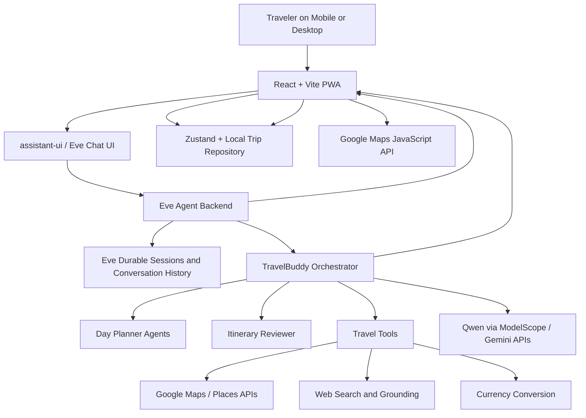

# TravelBuddy by Spartan

**Team:** Yee Ching Yang, Neoh Sun Hong, Quah Zhen Yee, Yoong Kah Quan  
**Problem Statement:** Travel Planner  
**Video Presentation:** [Unlisted Youtube Link](https://youtu.be/faeFNYilWSY)  
**Presentation Slides:** [Public Link](https://canva.link/5znn4xndo388gqs)  
**High Fidelity Prototype Link:** [Deployed in Vercel](https://travel-buddy-pwa.vercel.app/)

---

## 1. Project Overview

### The Problem
Planning a trip can be difficult because travelers need to use many different applications to find destination, calculating budgets, and plan itineraries. This is a time consuming process and make trip planning more complex.

The main stakeholder are travelers, families, and travel groups who need a convenient way to plan their trips.

Existing Applications such as Google Maps and Trip.com could help  users with booking and location navigation.However, they do not provide a complete travel planning that includes destination planning, budgeting and itinerary creation in one place.

### Our Solution
Our Solution is a TravelPlanner website that helps travelers organize their trip plan and refining their trip budget more easily. They can choose their destination, estimate budget and create a travel itineraries in a single platform. This could make trip planning simpler, more organized and less stressful.

---

## 2. Ideation & Process

### 2.1 Ideas We Considered

| Idea | Why it was dropped / kept |
| :--- | :--- |
| **Idea 1 (Chosen): Conversational, chat-first trip planner with a structured itinerary artifact (Eve agent + published timeline)** | Kept because it lets travelers state constraints (budget, dates, dietary needs, must-visit spots) in natural language while still producing a reviewable, editable artifact instead of a wall of chat text. This matched our goal of merging destination research, budgeting, and itinerary creation into one flow, and Eve already provides the durable sessions, tool calling, and subagent orchestration needed to support it. |
| **Idea 2 (Chosen): Multi-agent research and review pipeline (day-planner specialists + itinerary reviewer)** | Kept because a single generation pass was prone to hallucinated places, budget overruns, and inconsistent pacing across days. Splitting research into parallel day-planner agents and adding a dedicated reviewer step let us catch hard-constraint violations (budget, halal/dietary, must-visit locations, excessive travel) before publishing, which was a core differentiator over generic AI chatbots. |
| **Idea 3: Traditional multi-step form wizard (destination → dates → budget → travelers → itinerary, no chat)** | Dropped because a purely form-based flow is what existing itinerary planners already do (see comparison table in section 4). It would have been faster to build but would not support conversational edits like "make this trip cheaper" or "remove museums," which we saw as the main value-add over Google Maps/Trip.com. |
| **Idea 4: Single-call LLM itinerary generation without live map/place grounding** | Dropped because relying only on model memory for restaurants, opening hours, and travel times risked hallucinated recommendations. Mentor feedback and our own testing showed this hurt trust, so we required all place data to be verified through Google Maps/Places tools instead. |
| **Idea 5: Native mobile app (iOS/Android) instead of a PWA** | Dropped for the hackathon timeline. A native app would need separate iOS/Android codebases and app-store distribution, while a mobile-first PWA (via `vite-plugin-pwa`) gave installable, app-like behavior with a single React/Vite codebase and no store review process. |
| **Idea 6: Group/collective budget only, with no per-traveler breakdown** | Dropped after mentor consultation (10 Sep 2026, Lee Zi Yang) pointed out that budgets are more meaningful per traveler. We changed the budget input and planning logic to compute cost per person rather than treating the trip budget as one shared pool. |
| **Idea 7: Custom orchestration layer built directly on the Vercel AI SDK** | Dropped in favor of Eve as the orchestration/session layer, using Vercel AI SDK only for model access. Building custom session persistence, subagent coordination, and event streaming from scratch would have duplicated what Eve already provides and increased risk within the hackathon timeframe. |
| **Idea 8: Hosted database (e.g. Supabase) for trip persistence from day one** | Dropped for the prototype phase. We used a `localStorage`-backed repository abstraction so the core planning experience could be demonstrated without building authentication and a database migration path first. The abstraction keeps a hosted database as a straightforward later swap. |

### 2.2 Ideation Boards

**Mindmap**

**Problem Tree**

**User Flow**

### 2.3 Mentor Consultation

| Date | Mentor | Feedback Received | What Was Changed |
|:---|:---|:---|:---|
| 10 Sep 2026| Lee Zi Yang | The homepage included metrics that did not provide meaningful value to users. | Replaced the low-value metrics with a banner area for announcements, promotions, or sponsored content. |
| 10 Sep 2026 | Lee Zi Yang | User preferences could be collected and synchronized through keywords, with guiding questions used to better understand user interests. | Improved the preference-setting flow by using natural language LLM to extract relevant preference keywords and tags for personalized recommendations. |
| 10 Sep 2026| Lee Zi Yang | The travel budget should be specified for each individual traveler instead of being treated as one collective group budget. | Changed the budget input and planning logic to represent the budget per person, making itinerary recommendations and cost estimates more accurate. |
| 10 Sep 2026 | Lee Zi Yang | The itinerary should support sharing and collaboration between multiple users. | Added the concept of a sharing feature where users can invite collaborators to view and edit the same itinerary together. |

---

## 3. Design & Prototype

**High-Fidelity UI/UX Prototype:** [link](https://travel-buddy-pwa.vercel.app)  

**Key Screens**

1.Home Page

This is the first page users see when they open Travel Buddy. It gives a quick overview of the platform and lets users start planning their trip.

Users can entering their travel preference that help the system to generate a trip plan based on their needs.

2.Destination Page

Users enter where they want to travel and begin creating their trip plan.

3.Travel Date Page

Users select their travel dates so the system can organize the trip accordingly.

4.Budget Selection Page

Users choose their travel budget to help plan a trip that matches their spending limits.

5.Number of Travelers Page

Users specify how many people will be joining the trip.

6.Destination Selection Page

Users select the places and attractions they would like to visit during their trip.

7.AI Chat Page

AI chat could generates a personalized itinerary based on the user's preferences, budget, travel dates, and selected destinations.

After generating the itinerary,the complete trip plan was provided, including the daily schedule and estimated budget.

User can also click the map icon to view all the itinerary destination highlighted on the map.

8.Group Chat Page

Travel companions can discuss plans, share ideas, and deciding the trip together in one place.

## 4. What Makes It Different

TravelBuddy is not just a chatbot that recommends tourist attractions. It is a conversational travel companion that turns a traveler’s constraints into a practical, editable, and geographically coherent trip plan.

### Constraint-aware planning instead of generic recommendations

Travelers can provide hard constraints such as destination, dates, budget, group size, allergies, dietary restrictions, halal requirements, and must-visit locations. TravelBuddy treats these as requirements rather than suggestions.

The original twist is that the assistant does not simply generate an attractive-looking itinerary. It checks whether the plan actually fits the traveler’s real constraints and highlights tradeoffs when it does not.

### Live place and travel-time verification

TravelBuddy uses live map and place data to verify locations, opening hours, ratings, price categories, coordinates, and travel times. It can also group nearby activities together to avoid inefficient cross-city travel.

This is different from a traditional AI travel planner that may hallucinate restaurants, opening hours, or travel durations based on outdated training data. TravelBuddy’s recommendations are grounded in current location data whenever possible.

### Itineraries that are structured, not buried in chat

The assistant can publish a structured itinerary directly into the app as a visual timeline. The itinerary contains days, time periods, activities, locations, estimated costs, travel details, and notes.

The twist is that the chat is used as the planning interface, but the result is not left as a long text response. It becomes an interactive travel artifact that the traveler can review and revise.

### Conversational itinerary editing

Travelers can make natural requests such as:

- “Make this trip cheaper.”
- “Change day two.”
- “Remove museums.”
- “Find somewhere nearby.”
- “Add a halal restaurant after this activity.”

TravelBuddy preserves the unaffected parts of the itinerary while reshaping only the relevant sections. This makes itinerary planning feel more like collaborating with a personal assistant than filling out a rigid form.

### Multi-agent research and review

For longer trips, TravelBuddy can divide itinerary research into independent day ranges. Specialist planning agents research individual sections in parallel, while a separate reviewer checks the merged itinerary for:

- hard-constraint violations
- budget problems
- excessive travel
- repeated activities
- poor pacing
- missing must-visit locations
- lack of trip-wide coherence

The original twist is the separation between research, orchestration, and quality review. The final assistant is not relying on one unverified generation pass.

### Transparent budget and currency handling

TravelBuddy treats the trip budget as a first-class planning constraint. It accounts for the number of travelers and can convert the complete trip budget into the destination currency, including Malaysian Ringgit (`RM`) as a primary budget format in the interface.

Instead of presenting false precision, the assistant distinguishes between reliable prices and approximate estimates and explains tradeoffs when an itinerary may exceed the budget.

### Designed for travel conditions

The product is designed as a mobile-first Progressive Web App. It uses large touch targets, a compact conversational layout, timeline artifacts, map views, bottom sheets, and a persistent chat dock.

The difference is not only visual. The interface is optimized for travelers who may be using one hand, moving between locations, dealing with a mobile connection, or quickly checking the next activity.

### Comparison with existing solutions

| Capability | Generic AI chatbot | Google Maps | Traditional itinerary planner | TravelBuddy |
|---|---:|---:|---:|---:|
| Natural-language trip planning | Yes | Limited | Limited | Yes |
| Uses live place data | Sometimes | Yes | Sometimes | Yes |
| Remembers trip constraints | Usually inconsistent | Limited | Yes, but form-based | Yes |
| Checks budget and dietary requirements | Inconsistent | Limited | Sometimes | Yes |
| Produces a structured daily itinerary | Text-based | No | Yes | Yes |
| Edits an existing plan conversationally | Limited | No | Limited | Yes |
| Reviews the complete plan for conflicts | Rarely | No | Limited | Yes |
| Works as a mobile installable PWA | Not necessarily | App | Usually app/web | Yes |

## 5. Technical Architecture & Feasibility

### Tech stack

#### Frontend: React, Vite, and Progressive Web App

The frontend is built with React 19 and Vite. It is packaged as a Progressive Web App using `vite-plugin-pwa`, allowing users to launch TravelBuddy like a mobile application without requiring an app-store installation.

We chose React because it supports a component-based interface for chat, onboarding screens, itinerary timelines, maps, and bottom-sheet artifacts. Vite provides fast development and a lightweight production build.

The frontend uses:

- `@assistant-ui/eve` and `@assistant-ui/react` for the conversational interface
- React Router for screen and trip navigation
- Zustand for client-side trip and UI state
- Tailwind CSS for the design system
- Google Maps JavaScript API for map rendering
- Motion and Lucide for interaction and interface details

The main frontend constraint is mobile-first complexity. The interface needs to remain usable on small screens while also presenting maps, timelines, budgets, and chat. The initial scope therefore focuses on a polished mobile experience rather than attempting to support every desktop workflow.

#### Agent backend: Eve

The backend is built with Eve, which owns the agent runtime, durable sessions, conversation history, tool execution, subagents, and event streaming.

Eve is used instead of building a custom orchestration layer because TravelBuddy needs more than a single model call. The assistant must maintain trip context, call multiple tools, delegate research, wait for background agents, review results, and publish a final itinerary.

The backend includes:

- A root TravelBuddy agent
- Persistent trip context from the frontend
- Itinerary planning procedures
- `day_planner` specialist agents for parallel research
- An `itinerary_reviewer` specialist for final quality checks
- Tools for maps, places, travel times, currency, web search, and itinerary storage
- Eve’s streaming session API for real-time responses in the frontend

The primary constraint is orchestration complexity. Long itinerary requests can require multiple agent turns because specialist agents run in the background. The product handles this by showing concise progress messaging and only publishing an itinerary after the research and review stages are complete.

#### Models: Qwen through ModelScope and Gemini services

The project uses an OpenAI-compatible ModelScope inference endpoint for the primary Qwen model configuration. It also uses Google’s Gemini API for Gemini Flash and Google Search grounding where appropriate.

This approach gives the project flexibility to use different models for different tasks while keeping Eve as the session and orchestration layer. The model provider can be changed without replacing the application’s durable sessions, tools, or agent workflow.

Expected constraints include:

- API quotas and rate limits
- model latency for multi-step planning
- cost differences between model providers
- occasional uncertainty in generated recommendations
- the need to ground real-world claims in tools rather than model memory

TravelBuddy addresses these constraints through explicit agent instructions: real places should be checked with map tools, exact prices should not be fabricated, and uncertain information should be labeled clearly.

#### Maps and place APIs

TravelBuddy uses Google Maps-related services for:

- geocoding destinations and landmarks
- searching for restaurants, attractions, and other places
- retrieving place details and opening hours
- calculating travel time and distance
- displaying itinerary locations on a map

The frontend uses the Google Maps JavaScript API for map rendering, while backend tools provide grounded place and travel-time data to the agent.

The main constraint is API-key management and usage cost. Google Maps services may require an enabled billing account and have quotas. The demo will keep API keys in environment variables and limit calls to the capabilities needed for the prototype.

Map data can also change or be incomplete. TravelBuddy therefore treats opening hours, availability, prices, and halal status carefully instead of presenting unverified claims as facts.

#### Search and external travel information

A web search tool is available for information that map data cannot provide, such as events, festivals, or visa-related information.

Search is used as a fallback rather than the default source for every recommendation. This reduces unnecessary calls and helps prioritize structured, location-specific data from the map tools.

The constraint is that external web pages may be incomplete, outdated, or inconsistent. The assistant will communicate uncertainty and avoid presenting search results as guaranteed bookings or confirmations.

#### Persistence and database strategy

For the current prototype:

- Eve provides durable agent sessions and conversation history on the backend.
- The frontend stores trip records in browser `localStorage`.
- The frontend uses a repository abstraction so local persistence can later be replaced without changing the trip domain model.

This is intentional for the building phase: it allows us to demonstrate the complete planning experience without introducing a database migration and authentication system before the core product behavior is proven.

For a production version, the repository can be replaced with a hosted database such as Supabase or a Vercel-compatible database. That would enable cross-device trip history, user accounts, shared trips, and more reliable synchronization.

The current limitation is that local trip history is device- and browser-specific. Clearing browser storage or switching devices would not preserve those trips in the prototype.

#### Hosting and deployment

The frontend can be deployed as a static Vite PWA on Vercel or another static hosting provider. The Eve backend is designed to deploy to Vercel through Eve’s deployment workflow.

In local development:

- the frontend runs on port `3000`
- the Eve backend runs on port `2000`
- Vite proxies `/eve`, `/places`, and `/preferences` requests to the backend

In production, the frontend and backend can be deployed as separate services or connected through a shared Vercel deployment configuration.

The prototype currently allows anonymous access with permissive CORS for demonstration purposes. This is acceptable for a public hackathon demo, but it is not suitable for private or sensitive travel data. A production deployment would add authentication, authorization, stricter CORS, API-key protection, abuse prevention, and user-level data isolation.

### System architecture diagram

### Build plan and scope

During the building phase, we will focus on a complete, demonstrable core experience rather than attempting to build a full booking marketplace or social travel platform.

#### In scope

1. **Trip onboarding**
   - Destination selection
   - Travel dates
   - Budget
   - Number of travelers
   - Dietary and preference context

2. **Conversational travel assistant**
   - Natural-language travel questions
   - Personalized recommendations
   - Follow-up questions using the active trip context
   - Concise mobile-friendly responses

3. **Grounded place discovery**
   - Destination and place search
   - Opening-hour and place-detail lookup
   - Travel-time and distance calculations
   - Map-based place exploration

4. **Structured itinerary generation**
   - Daily itinerary timeline
   - Activities, meals, locations, and estimated costs
   - Budget-aware recommendations
   - Preservation of hard constraints
   - Publication of the generated itinerary into the app

5. **Conversational itinerary editing**
   - Change or remove activities
   - Make the trip cheaper
   - Add nearby places
   - Adjust plans around preferences or dietary requirements

6. **Agent orchestration**
   - Parallel day planning for longer trips
   - Full-plan itinerary review
   - Final constraint and consistency checks before publishing

7. **PWA experience**
   - Installable mobile web app
   - Responsive chat interface
   - Map screen
   - Itinerary timeline
   - Bottom sheets for place details and artifacts
   - Local trip persistence for the demo

#### Explicitly out of scope for the prototype

To keep the project feasible, the building phase will not attempt to implement:

- direct hotel, flight, or restaurant booking
- payment processing
- real-time airline or hotel inventory
- social collaboration with multiple authenticated travelers
- a full user account and cross-device synchronization system
- guaranteed offline AI planning
- comprehensive visa or legal advice
- production-grade recommendation coverage for every destination

The prototype’s success criterion is a reliable end-to-end flow: a traveler enters a trip brief, asks TravelBuddy for help, receives recommendations grounded in real place data, generates a structured itinerary, and revises that itinerary conversationally while respecting budget and personal constraints.